

<a href="https://sheytanoff.com"></a>

 

Hey, I'm Rado. Engineer in Dublin, mostly payments, security and product.

At the minute I'm a Product Advocate at Global Payments, on the Developer Experience team. Sample apps, docs and SDK fixes so devs can get live on our APIs faster.

Before that I was in Integration and Developer Support at Global Payments, and before that QA on Reality Labs devices at Meta.

On the side I test web apps for security holes, build iOS and web apps, and I'm a mentalist too. 500+ events so far for companies like WHOOP, McKinsey and Meta.

People always ask how that fits together.. for me its the same skill, finding what a person or a system gives away without meaning to.

Happy to chat about roles or projects, links are at the bottom.

 

<a href="https://ie.linkedin.com/in/radoslav-sheytanov-ruxton"></a>

  


  

<a href="https://sheytanoff.com/mentalist"></a><a href="https://sheytanoff.com/cyber"></a><a href="https://sheytanoff.com/dev"></a>

  


  

<a href="https://sybilsight.com"></a><a href="https://booked.kivimedia.co"></a>
<a href="https://github.com/globalpayments/dotnet-sdk/pulls?q=is%3Apr+author%3ARadoslavSheytanovGP"></a><a href="https://github.com/globalpayments-samples"></a>
<a href="https://sapienjournal.com"></a><a href="https://charliehewish.com">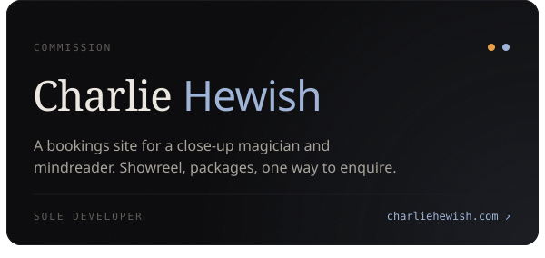</a>

  

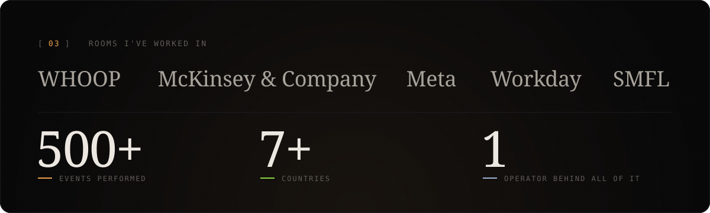

  


  

<a href="https://sheytanoff.com/#contact"></a>

  

&nbsp;&nbsp;

  


